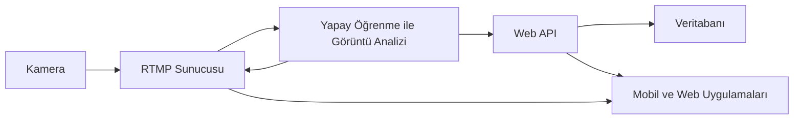

# Bitirme-Tezi-Demo

## Yapay Zekâ Tabanlı Kişi Profil Analiz Uygulaması

Bu proje, fiziksel mağazalara gelen müşterilerin demografik özelliklerini (yaş ve cinsiyet) analiz eden yapay zekâ tabanlı bir sistemdir. Kamera görüntüleri gerçek zamanlı işlenerek derin öğrenme modelleri ile tahmin yapılır ve sonuçlar yönetim paneli üzerinden görselleştirilir.

## Projenin Amacı

Gerçek zamanlı yüz tespiti yaparak bireylerin yaş ve cinsiyetini tahmin etmek

Tahmin sonuçlarını zaman, tarih ve lokasyon bilgileriyle birlikte veritabanına kaydetmek

Mağaza yöneticilerine yönetim paneli aracılığıyla:

Yaş dağılımı

Cinsiyet oranı

Zaman bazlı müşteri yoğunluğu raporları sunmak

Perakende sektöründe veri odaklı karar alma süreçlerine katkı sağlamak

## Teknik Özellikler

Görüntü İşleme: OpenCV, FFmpeg, YuNet CNN tabanlı yüz tespiti

Derin Öğrenme Modelleri: ResNet50v2, DenseNet, MobileNet, EfficientNet

Backend: Spring Boot (Java, REST API), güvenli veri kaydı

Veritabanı: PostgreSQL, özel tablo ve ER diyagram tasarımları

Dashboard: Grafik tabanlı raporlar, zaman bazlı analiz ve filtreleme

## Kullanılan Araçlar ve Teknolojiler

Programlama Dilleri: Python (AI ve görüntü işleme), Java (Spring Boot backend)

Kütüphaneler (AI): TensorFlow, Keras, OpenCV

Video İşleme: FFmpeg

Veri Setleri: UTKFace, Biggest Gender/Face Recognition Dataset

Backend: Spring Boot (Controller-Service-Repository katmanı)

Veritabanı: PostgreSQL

Veri Görselleştirme: Matplotlib, custom dashboard

## Sistem Akış Diyagramı

OpenCV ve FFmpeg ile gerçek zamanlı görüntü işleme pipeline’ı geliştirdim

CNN tabanlı farklı derin öğrenme mimarilerini karşılaştırdım ve optimize ettim

Spring Boot ile REST API geliştirdim ve güvenli veri kaydı sağladım

PostgreSQL üzerinde ER diyagramı ve tablo tasarımları yaptım

Yönetim panelinde grafik tabanlı raporlama modülleri geliştirdim

## Akademik Bilgi

Bu proje, Düzce Üniversitesi Bilgisayar Mühendisliği Bitirme Tezi (2025) kapsamında hazırlanmıştır.

Hazırlayan: Muhammed Ali Türkan

Danışman: Doç. Dr. Abdullah Talha Kabakuş

Anahtar Kelimeler: Görüntü işleme, Derin öğrenme, Cinsiyet tespiti, Yaş tahmini, Müşteri analizi, Spring Boot

## Örnek Kullanım Senaryoları

Perakende: Müşteri profili çıkarma, kampanya zamanlaması, ürün yerleşimi optimizasyonu

Güvenlik: Yaş ve cinsiyet tabanlı giriş kontrol sistemleri

Pazarlama: Demografi odaklı reklam hedefleme

