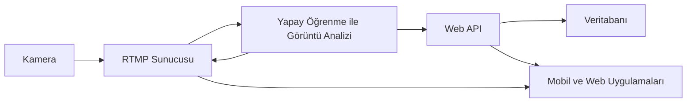

# Yapay Zekâ Tabanlı Kişi Profil Analiz Uygulaması

Bu proje, fiziksel mağazalara gelen müşterilerin demografik özelliklerini (yaş ve cinsiyet) analiz eden yapay zekâ tabanlı bir sistemdir.
Gerçek zamanlı kamera görüntüleri OpenCV ve FFmpeg pipeline’ı ile işlenir, CNN tabanlı derin öğrenme modelleri ile tahmin yapılır ve sonuçlar PostgreSQL veritabanına kaydedilir. Yönetim paneli üzerinden ise bu veriler grafik ve raporlar halinde görselleştirilir.

## Projenin Amacı

Fiziksel mağazalarda müşteri profili çıkarmak

Yaş ve cinsiyet dağılımını gerçek zamanlı analiz etmek

Yoğunluk takibi ile kampanya zamanlaması ve ürün yerleşimi optimizasyonu yapmak

Perakende sektöründe veri odaklı karar alma süreçlerine katkı sağlamak

## Teknik Özellikler

Görüntü İşleme: OpenCV, YuNet CNN tabanlı yüz tespiti

Video Pipeline: FFmpeg ile RTMP stream işleme

Derin Öğrenme Modelleri: ResNet50v2, DenseNet, MobileNet, EfficientNet

Backend: Spring Boot (Java, REST API), güvenli veri kaydı

Veritabanı: PostgreSQL, özel tablo ve ER diyagram tasarımları

Dashboard: Web tabanlı grafikler, zaman bazlı analiz, filtreleme

## Kullanılan Araçlar ve Teknolojiler

Programlama Dilleri:

Python → Yapay zeka modelleri & görüntü işleme

Java → Spring Boot backend & REST API

Kütüphaneler (AI): TensorFlow, Keras, OpenCV

Video İşleme: FFmpeg (RTMP streaming)

Veri Setleri:

UTKFace (yaş tahmini için)

Biggest Gender/Face Recognition Dataset (cinsiyet tahmini için)

Veritabanı: PostgreSQL (tablo ilişkileri + ER diyagramı)

Veri Görselleştirme: Matplotlib + Custom Web Dashboard

## Sistem Akış Diyagramı

## OpenCV & FFmpeg Pipeline

FFmpeg mağazadaki kameradan gelen görüntüyü RTMP server üzerinden yayına alır.

ffmpeg -i rtsp://kamera_ip -f flv rtmp://localhost:1935/live/stream

OpenCV bu yayını okur, YuNet CNN modeli ile yüzleri tespit eder.

cap = cv2.VideoCapture("rtmp://localhost:1935/live/stream")
while True:
    ret, frame = cap.read()
    faces = face_detector.detect(frame)  # YuNet

Yüz bölgesi kırpılarak CNN modeline verilir → Yaş ve cinsiyet tahmini yapılır.

Sonuçlar anlık olarak API’ye JSON formatında gönderilir ve görüntü üstüne overlay (etiket + yaş/cinsiyet bilgisi) eklenir.
Ayrıca görüntü kaydedilir.

## Person Count Tablosu
| Alan            | Tipi      | Açıklama                        |
| --------------- | --------- | ------------------------------- |
| **id**          | SERIAL    | Birincil anahtar                |
| **gender**      | TEXT      | “Male” / “Female”               |
| **age\_range**  | TEXT      | “0-12”, “13-19”, “20-35” …      |
| **city**        | TEXT      | Görüntü kaydının alındığı şehir |
| **created\_at** | TIMESTAMP | Tarih & saat bilgisi            |

## Age Ranges Tablosu
| age\_range | min | max |
| ---------- | --- | --- |
| 0-12       | 0   | 12  |
| 13-19      | 13  | 19  |
| 20-35      | 20  | 35  |
| 36-54      | 36  | 54  |
| 55+        | 55  | ∞   |

person_count tablosu, age_ranges ile ilişkili.

Dashboard sorguları bu tablolardan beslenir.

## API Yapısı (Spring Boot)

API, Controller → Service → Repository katmanları ile yazıldı.

Örnek API Endpoint’leri:

POST /api/v1/person → Yeni bir tahmin kaydı ekler

GET /api/v1/stats/age → Yaş dağılımı raporu

GET /api/v1/stats/gender → Cinsiyet oranı

GET /api/v1/stats/time?start=...&end=... → Zaman bazlı yoğunluk raporu

Örnek JSON:

{
  "gender": "Female",
  "age_range": "20-35",
  "city": "Düzce",
  "created_at": "2025-06-05T14:32:00Z"
}

## Dashboard Özellikleri

Pasta Grafik → Cinsiyet dağılımı

Bar Grafik → Yaş aralığı analizi

 
 

Zaman Serisi → Günlük / saatlik yoğunluk

Filtreleme → Tarih aralığı, şehir seçimi

Canlı Görüntü → Kamera akışı + overlay etiketler

## Akademik Bilgi

Bu proje, Düzce Üniversitesi Bilgisayar Mühendisliği Bitirme Tezi (2025) kapsamında hazırlanmıştır.
Danışman: Doç. Dr. Abdullah Talha Kabakuş

Anahtar Kelimeler: Görüntü işleme, Derin öğrenme, Cinsiyet tespiti, Yaş tahmini, Müşteri analizi, Spring Boot

## Örnek Kullanım Senaryoları

Perakende:

Müşteri profili çıkarma

Kampanya zamanlaması

Ürün yerleşimi optimizasyonu

Güvenlik:

Yaş ve cinsiyet tabanlı giriş kontrol sistemleri

Pazarlama:

Demografi odaklı reklam hedefleme

